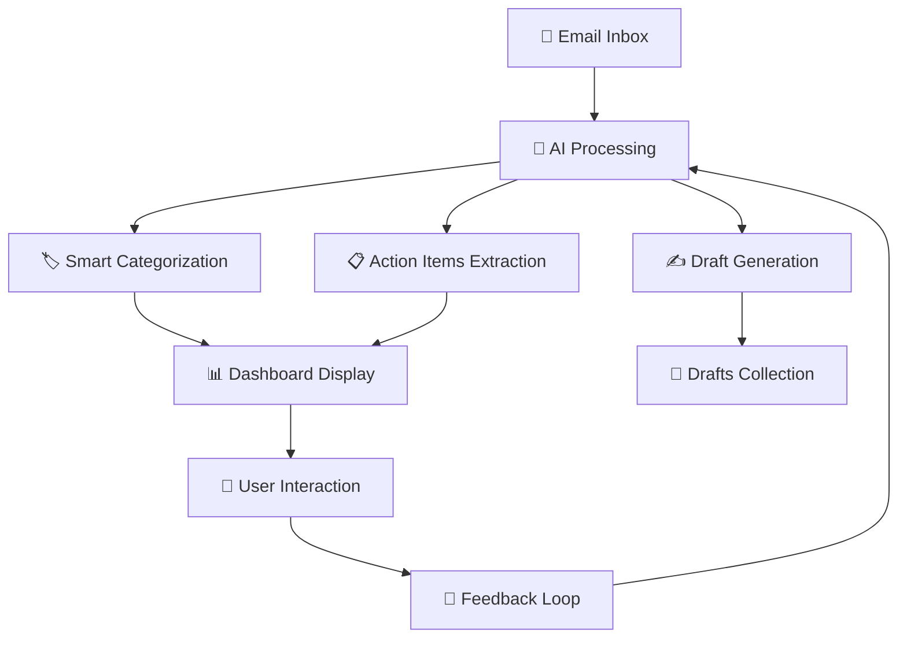

# 🚀 AI-Powered Email Dashboard

<div align="center">


*Transform your email chaos into organized productivity with AI magic* ✨

</div>

A cutting-edge, full-stack productivity powerhouse that revolutionizes your email workflow through intelligent AI categorization, automated insights extraction, and smart draft generation. Experience the future of email management today!

**🎯 Built for modern productivity enthusiasts who value intelligent automation**

---

## 🌟 Key Highlights

<table>
<tr>
<td width="50%">

### 🤖 **AI-First Approach**
- Smart email categorization using LLM
- Context-aware action item extraction  
- Intelligent reply draft generation
- Custom prompt engineering interface

</td>
<td width="50%">

### 🎨 **Modern UX/UI**
- Beautiful glassmorphism design
- Responsive dashboard interface
- Real-time updates and interactions
- Intuitive keyboard shortcuts

</td>
</tr>
<tr>
<td>

### 🔧 **Enterprise Ready**
- PostgreSQL with Prisma ORM
- Scalable Node.js backend
- Secure API key management
- Docker-ready deployment

</td>
<td>

### ⚡ **Developer Experience**
- Hot reload with Vite
- Type-safe with TypeScript
- Modern React with hooks
- Comprehensive documentation

</td>
</tr>
</table>

## ✨ Core Features

🎯 **Smart Inbox Management**
- **Zero-Inbox Philosophy:** AI categorizes emails automatically (Work, Personal, Shopping, Social, Finance, Design, etc.)
- **Intelligent Search:** Natural language search with filtering capabilities
- **Batch Processing:** Process multiple emails with a single AI request
- **Visual Indicators:** Unread counts, category badges, and priority markers

🧠 **AI-Powered Intelligence**
- **Action Item Extraction:** Automatically identify tasks, deadlines, and follow-ups from email content
- **Context-Aware Drafts:** Generate professional reply drafts that match tone and context
- **Custom Prompt Engineering:** Fine-tune AI behavior with the "Prompt Brain" interface
- **Learning System:** Continuously improve categorization based on your preferences

🎨 **Beautiful User Experience**
- **Glassmorphism Design:** Modern, translucent interface with backdrop blur effects
- **Responsive Layout:** Perfect on desktop, tablet, and mobile devices
- **Dark/Light Mode:** Adaptive theming for any time of day
- **Smooth Animations:** Micro-interactions that delight users

🔒 **Security & Privacy**
- **Environment Variables:** All secrets safely managed via `.env`
- **API Key Rotation:** Easy credential management and rotation
- **CORS Protection:** Secure cross-origin request handling
- **Data Validation:** Input sanitization and validation on all endpoints

---

## 🛠️ Tech Stack & Architecture

<div align="center">

| Frontend | Backend | Database | AI | DevTools |
|----------|---------|----------|-------|----------|
|  |  |  |  |  |
|  |  |  |  |  |
|  |  |  | | |

</div>

### 🏗️ Architecture Overview
```
┌─────────────────┐    ┌─────────────────┐    ┌─────────────────┐
│   Frontend      │    │    Backend      │    │   Database      │
│   (React/Vite)  │◄──►│ (Node.js/Express│◄──►│  (PostgreSQL)   │
│                 │    │   + Prisma)     │    │                 │
└─────────────────┘    └─────────────────┘    └─────────────────┘
         │                        │                        │
         │                        ▼                        │
         │              ┌─────────────────┐                │
         └─────────────►│   OpenRouter    │◄───────────────┘
                        │   AI Service    │
                        └─────────────────┘
```

---

## ⚡ Quick Start Guide

### 📋 Prerequisites
- **Node.js** 18+ and npm
- **PostgreSQL** database (local or cloud)
- **OpenRouter API key** for AI features

### 🚀 Installation

<details>
<summary><b>🔽 Click to expand step-by-step setup</b></summary>

#### 1️⃣ Clone & Navigate
```bash
git clone https://github.com/Mukul2956/email-agent.git
cd email-agent
```

#### 2️⃣ Backend Setup
```bash
cd backend
npm install
cp .env.example .env
# Edit .env with your database URL and OpenRouter API key
```

#### 3️⃣ Database Migration
```bash
npx prisma generate
npx prisma migrate dev --name init
npx prisma db push
```

#### 4️⃣ Frontend Setup
```bash
cd ../frontend
npm install
```

#### 5️⃣ Launch Application
```bash
# Terminal 1: Start backend
cd backend && npm start

# Terminal 2: Start frontend  
cd frontend && npm run dev
```

</details>

### 🎯 Quick Commands
```bash
# Health check
curl http://localhost:5000/api/health

# Load sample data
curl -X POST http://localhost:5000/api/emails/load-mock

# View database
npx prisma studio
```

---

## 🌐 Live Demo

**🔗 Frontend:** [https://email-agent-jade.vercel.app](https://email-agent-jade.vercel.app)  
**🔗 Backend API:** [https://email-agent-backend-ole0.onrender.com/api](https://email-agent-backend-ole0.onrender.com/api)  
**🏥 Health Check:** [https://email-agent-backend-ole0.onrender.com/api/health](https://email-agent-backend-ole0.onrender.com/api/health)

### 🚀 Deployment Status
- **Frontend:** Deployed on Vercel
- **Backend:** Deployed on Render  
- **Database:** Supabase PostgreSQL
- **AI Service:** OpenRouter API

---

## 🧠 How It Works

<div align="center">



</div>

### 🔄 Workflow Steps

1. **📨 Email Loading:** Import emails from database or mock data
2. **🤖 AI Analysis:** Process emails through OpenRouter LLM with custom prompts
3. **🏷️ Smart Categorization:** Automatically sort into Work, Personal, Shopping, etc.
4. **📋 Action Extraction:** Identify tasks, deadlines, and follow-ups
5. **✍️ Reply Generation:** Create context-aware draft responses
6. **🎨 Visual Display:** Present results in beautiful, interactive dashboard
7. **⚙️ Customization:** Fine-tune AI behavior through Prompt Brain interface

### 🎮 User Journey
- **Inbox View:** Browse categorized emails with search and filtering
- **AI Processing:** One-click batch processing for smart categorization  
- **Draft Creation:** Generate professional replies instantly
- **Prompt Engineering:** Customize AI behavior for your workflow
- **Settings & Config:** Manage integrations and preferences

---

## 🔒 Security & Best Practices

<div align="center">

| 🛡️ Security Layer | 🔧 Implementation | ✅ Status |
|-------------------|-------------------|-----------|
| **Environment Variables** | `.env` files for secrets | Secured |
| **API Key Management** | OpenRouter keys excluded from repo | Protected |
| **CORS Protection** | Configured origins and credentials | Active |
| **Input Validation** | Request sanitization and validation | Implemented |
| **Error Handling** | Graceful error responses | Robust |
| **Database Security** | Prisma ORM with parameterized queries | Safe |

</div>

### 🔐 Security Checklist
- ✅ All API keys stored in `.env` (never committed)
- ✅ `.gitignore` properly configured for secrets
- ✅ Example files use placeholders only
- ✅ CORS configured for trusted origins
- ✅ Input validation on all endpoints
- ✅ Error handling prevents information leakage

> **⚠️ Important:** Always rotate your API keys if accidentally exposed and never commit real credentials to version control.

---

## 📚 Documentation & Resources

### 📖 **Essential Reading**
- **[📋 Database Setup Guide](DATABASE_SETUP.md)** - Complete database configuration
- **[🗃️ Database Schema](backend/prisma/schema.prisma)** - Data models and relationships
- **[⚙️ API Endpoints](backend/routes/)** - Backend route documentation
- **[🎨 UI Components](frontend/src/components/)** - Reusable React components

### 🔗 **Quick Links**
- **Backend Health:** [`http://localhost:5001/api/health`](http://localhost:5001/api/health)
- **Frontend Dev:** [`http://localhost:3000`](http://localhost:3000)
- **Database Studio:** Run `npx prisma studio`
- **API Documentation:** Available in route files

---

## 🛠️ Troubleshooting & FAQ

<details>
<summary><b>🚨 Common Issues & Solutions</b></summary>

### Database Connection Issues
```bash
# Check PostgreSQL status
sudo systemctl status postgresql

# Reset database migrations
npx prisma migrate reset

# Regenerate Prisma client
npx prisma generate
```

### Frontend Build Issues
```bash
# Clear node_modules and reinstall
rm -rf node_modules package-lock.json
npm install

# Check for port conflicts
lsof -ti:5173 # Kill process if needed
```

### API Key Problems
```bash
# Verify environment variables
echo $OPENROUTER_API_KEY

# Check .env file location and syntax
cat backend/.env
```

### Performance Optimization
- Use database indexing for large email datasets
- Implement pagination for email lists
- Cache frequently accessed prompts
- Use connection pooling for database

</details>

---

## 🚀 Deployment & Production

<div align="center">

| Platform | Backend | Frontend | Database |
|----------|---------|----------|----------|
| **Vercel** | ❌ | ✅ React | 🔗 Supabase |
| **Render** | ✅ Node.js | ❌ | 🔗 PostgreSQL |
| **Railway** | ✅ Express | ✅ Static | ✅ PostgreSQL |
| **Heroku** | ✅ Node.js | ✅ React | ✅ Postgres Add-on |

</div>

### 🌐 Production Deployment Steps

**Backend (Render):**
1. **Environment Setup:** Configure production environment variables
2. **Database Migration:** Run `npx prisma migrate deploy`
3. **CORS Configuration:** Update allowed origins for production domains
4. **Port Binding:** Ensure server listens on `0.0.0.0:PORT`

**Frontend (Vercel):**
1. **Environment Variables:** Set `VITE_API_BASE_URL` and `VITE_OPENROUTER_API_KEY`
2. **Build Configuration:** Output directory: `dist`, Build command: `npm run build`
3. **SPA Routing:** Add `_redirects` file for client-side routing support
4. **Domain Setup:** Configure custom domain if needed

### 🔧 Environment Variables Required

**Backend (.env):**
```env
NODE_ENV=production
PORT=10000
DATABASE_URL=your_postgresql_connection_string
DIRECT_URL=your_direct_db_connection_string  
OPENROUTER_API_KEY=your_openrouter_api_key
JWT_SECRET=your_jwt_secret
```

**Frontend (Vercel Dashboard):**
```env
VITE_API_BASE_URL=https://your-backend.onrender.com/api
VITE_OPENROUTER_API_KEY=your_openrouter_api_key
```

---

## 🤝 Contributing & Community

### 🌟 **How to Contribute**
1. **🍴 Fork** the repository
2. **🌿 Create** a feature branch (`git checkout -b feature/amazing-feature`)
3. **💾 Commit** your changes (`git commit -m 'Add amazing feature'`)
4. **📤 Push** to the branch (`git push origin feature/amazing-feature`)
5. **🔄 Open** a Pull Request

### 📋 **Contribution Guidelines**
- Follow existing code style and patterns
- Add tests for new features
- Update documentation for API changes
- Never commit secrets or API keys
- Use descriptive commit messages

### 💬 **Community & Support**
- 🐛 **Bug Reports:** Use GitHub Issues with detailed reproduction steps
- 💡 **Feature Requests:** Open an issue with enhancement label
- 📧 **Questions:** Check existing issues or start a discussion
- 🔧 **Development:** Follow the setup guide and best practices

---

<div align="center">

## 🎉 **Ready to Transform Your Email Game?**

**⭐ Star this repo** • **🍴 Fork it** • **🚀 Deploy it** • **🤝 Contribute**

<sub>Built with ❤️ by the Email Productivity Team</sub>

**[📝 MIT License](LICENSE)** | **[🐛 Report Bug](../../issues)** | **[💡 Request Feature](../../issues)**

---

*Happy emailing! 📧✨*

</div>